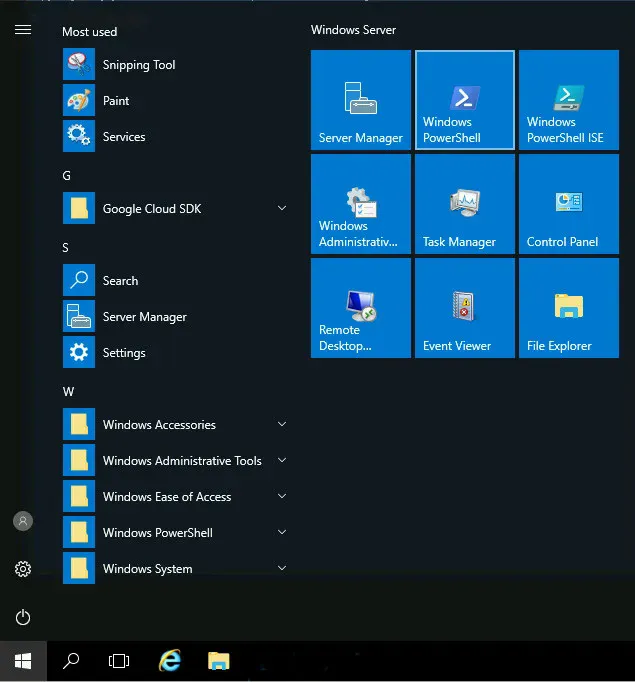
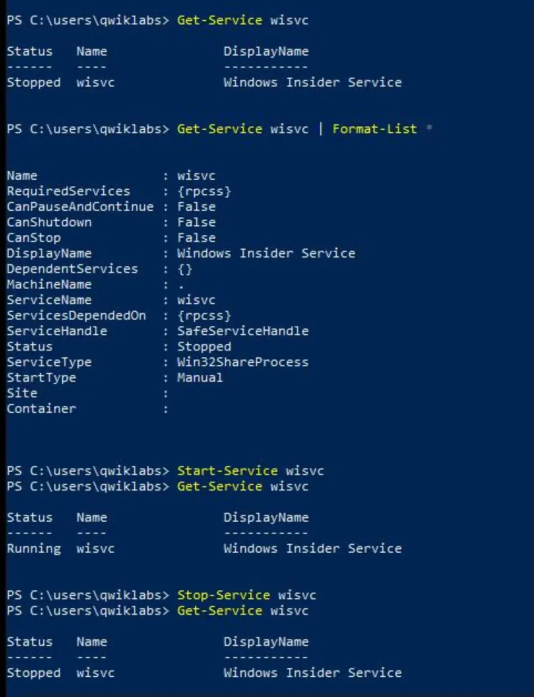
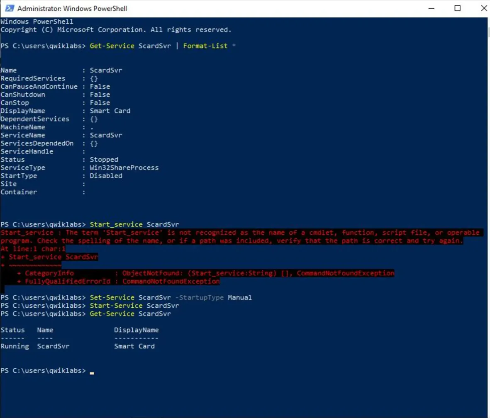
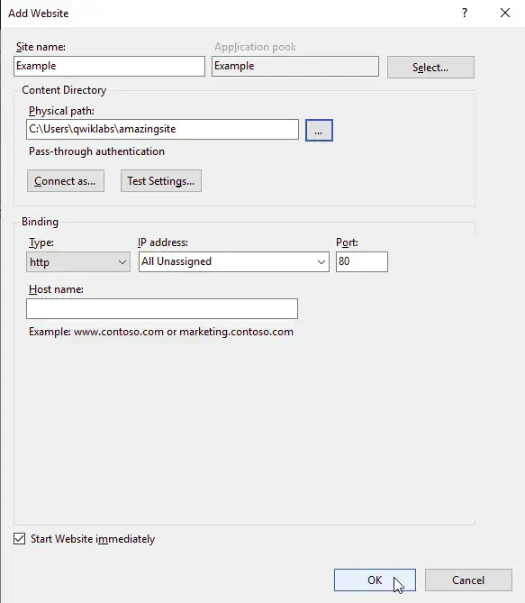
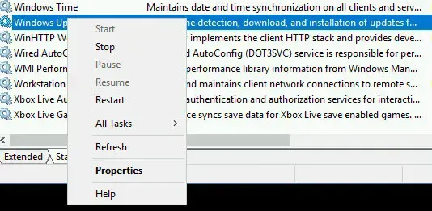
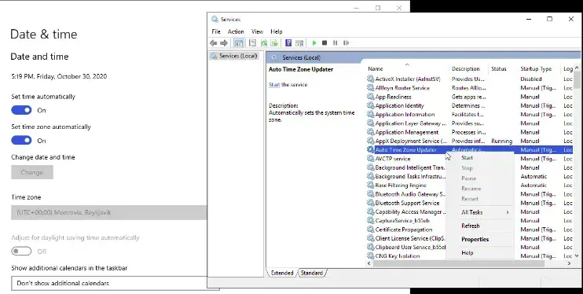

# Lab 2.2: Managing System Services in Windows
**Course:** System Administration and IT Infrastructure Services
---
## Lab Overview
The objective of this hands-on lab was to demonstrate essential **system administration skills** in a Windows Server environment. The core tasks involved controlling services via both GUI and PowerShell command-line interface, enabling system features, and configuring web services. This showcases foundational abilities to maintain and manage Windows server infrastructure.

## Skills Demonstrated
* **Service Management via GUI:** Using the Services management console to start, stop, and configure Windows services.
* **PowerShell Proficiency:** Managing services through command-line using `Get-Service`, `Start-Service`, `Stop-Service`, and `Set-Service`.
* **Windows Feature Installation:** Enabling additional system features using `Install-WindowsFeature`.
* **Web Server Configuration:** Installing and configuring Internet Information Services (IIS) to serve web pages.
* **Service Troubleshooting:** Diagnosing disabled services and modifying startup types to enable functionality.

---

## Step-by-Step Execution

### 1. Introduction to PowerShell Service Management
The lab began with learning how to interact with Windows services through PowerShell rather than relying solely on GUI tools, which is essential for automation and remote administration.

**Opening PowerShell:**



**Listing All Services:**
```powershell
Get-Service
```

This command displays all available services with their status, short name, and display name. The output includes hundreds of services, both running and stopped.

### 2. Examining and Controlling the Windows Insider Service
To practice service management, the lab focused on the Windows Insider Service (`wisvc`), demonstrating how to check status, start, and stop services.

| Action | Command Used | Result |
| :--- | :--- | :--- |
| **Basic Status** | `Get-Service wisvc` | Service was stopped |
| **Detailed Information** | `Get-Service wisvc \| Format-List *` | Revealed startup type, dependencies, and capabilities |
| **Start Service** | `Start-Service wisvc` | Service started successfully |
| **Verify Running** | `Get-Service wisvc` | Confirmed service status changed to Running |
| **Stop Service** | `Stop-Service wisvc` | Service stopped successfully |
| **Verify Stopped** | `Get-Service wisvc` | Confirmed service status changed to Stopped |



### 3. Troubleshooting and Enabling Disabled Services
This section demonstrated how to work with services that are disabled and cannot be started until their startup type is changed.

**Target Service:** Smart Card service (`ScardSvr`)

**The Problem:**
When attempting to start a disabled service, PowerShell returns an error indicating the service cannot be started.

**The Solution:**
1. **Diagnosis:** Used `Get-Service ScardSvr | Format-List *` to identify that `StartType: Disabled`
2. **Attempted Start (Failed):**
   ```powershell
   Start-Service ScardSvr
   ```
   This produced an error in red text showing the service cannot be started due to its disabled state.

3. **Enable the Service:**
   ```powershell
   Set-Service ScardSvr -StartupType Manual
   ```
   This changes the startup type from Disabled to Manual, allowing the service to be started.

4. **Successful Start:**
   ```powershell
   Start-Service ScardSvr
   Get-Service ScardSvr
   ```
   The service now starts without errors and shows a Running status.



### 4. Installing Windows Features with PowerShell
Demonstrated the installation of additional Windows features that are not enabled by default, specifically the IIS web server role.

**Installing IIS Web Server:**
```powershell
Install-WindowsFeature Web-WebServer,Web-Mgmt-Tools -IncludeAllSubFeature
```

This command:
- Downloads required components from Windows Update
- Installs the web server role and management tools
- Includes all sub-features automatically
- Takes several minutes to complete with a progress indicator

**Output confirmation:**
```
Success Restart Needed Exit Code      Feature Result
------- -------------- ---------      --------------
True    No             Success        {.NET Framework 3.5 (includes .NET 2.0 and...
```

**Verifying IIS Service:**
```powershell
Get-Service IISADMIN
```
The IIS Admin Service was confirmed to be running, indicating successful installation.


### 5. Configuring IIS Web Server via GUI
After installing IIS through PowerShell, the lab demonstrated how to configure it to serve a custom website using the Internet Information Services (IIS) Manager GUI.

**Configuration Steps:**
1. Opened **Internet Information Services (IIS) Manager** from the Start menu
2. Expanded the server node and navigated to **Sites**
3. Right-clicked on Sites and selected **Add Website**
4. Configured the new site with the following settings:
   - **Site name:** Example
   - **Physical path:** `C:\Users\qwiklabs\amazingsite`
   - **Binding Type:** http
   - **IP address:** All Unassigned
   - **Port:** 80
   - **Start Website immediately:** Checked



**Verification:**
The new website was successfully created and set to start immediately. Accessing the server's IP address on port 80 displayed the custom site content.


### 6. GUI vs PowerShell: Two Approaches to Service Management
Throughout this lab, both GUI and command-line methods were demonstrated, showcasing the advantages of each approach.

**Using the Services Management Console:**
The graphical Services application provides an intuitive interface with right-click context menus offering options to Start, Stop, Pause, Resume, and Restart services, as well as access to detailed Properties dialogs.



**Comparison Table:**

| Task | GUI Method | PowerShell Method | Best Use Case |
| :--- | :--- | :--- | :--- |
| View Service Status | Services console | `Get-Service` | GUI for single checks, PowerShell for scripting |
| Start/Stop Services | Right-click context menu | `Start-Service` / `Stop-Service` | PowerShell for automation and remote management |
| Change Startup Type | Service Properties dialog | `Set-Service -StartupType` | PowerShell for bulk changes across multiple servers |
| Install Features | Server Manager wizard | `Install-WindowsFeature` | PowerShell for repeatable, documented deployments |
| Get Detailed Info | Properties dialog tabs | `Get-Service \| Format-List *` | PowerShell for scripting and filtering output |

---

## Final Results and Conclusion
This lab successfully demonstrated the ability to manage Windows services through both graphical and command-line interfaces. Key accomplishments included:

✅ **Service Discovery:** Listed and examined available Windows services  
✅ **Service Control:** Started, stopped, and verified service state changes  
✅ **Troubleshooting:** Diagnosed and resolved issues with disabled services  
✅ **Feature Installation:** Installed IIS web server role via PowerShell  
✅ **Web Configuration:** Configured IIS to serve custom web content  
✅ **Dual Proficiency:** Demonstrated competence with both GUI and CLI tools  

These skills are essential for any Windows system administrator, particularly for automating repetitive tasks and managing servers remotely. The combination of GUI knowledge for troubleshooting and PowerShell expertise for automation represents a well-rounded approach to Windows system administration.

**Key Takeaway:** While GUI tools are excellent for learning and occasional tasks, PowerShell provides the power and flexibility needed for professional system administration, especially when managing multiple servers or automating routine maintenance tasks.


